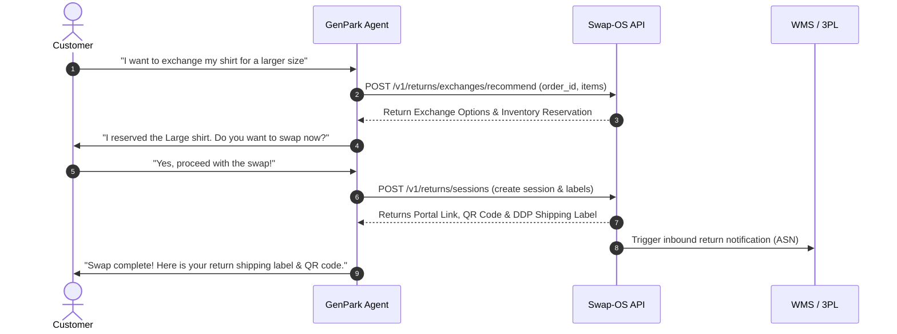

# Swap Commerce Agentic Storefront Skill

## Overview

[Swap Commerce](https://www.swap-commerce.com/) is an e-commerce Operating System (Swap-OS) that consolidates returns, exchanges, international shipping, tax/duty compliance, and logistics into a single, unified pipeline. This skill enables GenPark AI agents to integrate Swap-OS capabilities directly into digital storefronts, transforming standard, static catalogs into highly interactive, conversational shopping and post-purchase experiences.



---

## Core Capabilities

### 1. Branded Returns & Revenue Retention
*   **Instant Returns Portal:** Set up fully branded self-service returns portals matching the merchant’s storefront design.
*   **Revenue Retention (Shop Now):** Provide interactive cross-sell and instant exchange suggestions when a return is initiated. Retain up to 12%+ of revenue before refunds are issued.
*   **Flexible Refund Options:** Automate issuing refunds to original payment methods, store gift cards, or shopping wallet balances.

### 2. International Commerce & Cross-Border DDP
*   **Landed Cost Engine:** Compute real-time duties, local taxes (VAT/GST), and total landed cost dynamically during checkout.
*   **DDP (Delivered Duty Paid) Shipping:** Eliminate surprise customs fees for international buyers by collecting duties upfront and preparing compliant custom paperwork.
*   **Regional Consolidation:** Consolidate international returns at regional hubs before bulk shipping back to the primary WMS to save logistics costs.
*   **Product Compliance:** Automatically map HS (Harmonized System) codes and verify Country of Origin (COO) for cross-border compliance (e.g., EU GPSR requirements).

### 3. Conversational Discovery & Try-On
*   **Virtual Try-On (VTO):** Give shoppers visual confidence by matching product specs to personal models or avatars.
*   **Sizing & Fit Recommendation:** Utilize purchase history and return records across the network to suggest the optimal size, lowering return rates.

### 4. Direct In-Flow Conversational Checkout
*   **Chat/Voice Sales:** Enable frictionless transaction processing directly within the agent chat interface without traditional web checkout redirects.
*   **Payment Orchestration:** Support tokenized, safe payments, one-click checkouts, and express digital wallet checkouts (Apple Pay, Google Pay).

---

## API Reference & Payloads

### 1. Create Return/Exchange Session
`POST https://api.swap-commerce.com/v1/returns/sessions`

**Request Headers:**
```http
Authorization: Bearer <your_swap_api_key>
Content-Type: application/json
```

**Request Payload:**
```json
{
  "order_id": "ord_8941278930",
  "customer": {
    "email": "customer@example.com",
    "country_code": "US"
  },
  "items": [
    {
      "sku": "TSHIRT-BLU-M",
      "quantity": 1,
      "reason": "SIZE_TOO_SMALL",
      "action": "EXCHANGE",
      "exchange_sku": "TSHIRT-BLU-L"
    }
  ],
  "shipping": {
    "carrier": "USPS",
    "method": "GROUND_RETURN"
  }
}
```

**Response Payload:**
```json
{
  "return_session_id": "ret_sess_77812930",
  "status": "APPROVED",
  "exchange_order_id": "ord_ex_990184712",
  "label_url": "https://shipping.swap-commerce.com/labels/lbl_9981a3d9f.pdf",
  "qr_code_url": "https://shipping.swap-commerce.com/qrcodes/qr_9981a3d9f.png",
  "estimated_delivery": "2026-05-22T18:00:00Z"
}
```

### 2. Calculate Landed Cost (Cross-Border Duties)
`POST https://api.swap-commerce.com/v1/cross-border/landed-cost`

**Request Payload:**
```json
{
  "origin_country": "US",
  "destination_country": "GB",
  "items": [
    {
      "sku": "HOODIE-GRY-L",
      "hs_code": "6101.30.00",
      "declared_value": 85.00,
      "quantity": 1
    }
  ],
  "shipping_cost": 15.00
}
```

**Response Payload:**
```json
{
  "total_landed_cost": 121.25,
  "breakdown": {
    "subtotal": 85.00,
    "shipping": 15.00,
    "duty": 10.20,
    "tax_vat": 11.05
  },
  "currency": "GBP",
  "compliant": true
}
```

---

## Agent Usage & Best Practices

When integrating the `Swap Commerce` skill, agents must structure storefront behaviors around the following guidelines:

1.  **Context-Driven Recommendations:** If a user initiates a return due to "fit/size," the agent should look up `POST /v1/returns/exchanges/recommend` immediately to reserve the matching correct size in inventory.
2.  **Upfront Landed Cost Transparency:** For international shoppers, calculate the landed costs at the earliest cart stage, presenting the tax/duty breakdown clearly to maximize checkout conversion and compliance.
3.  **Proactive Tracking:** Send proactive push notifications or conversational alerts when return packages are checked in at regional consolidation centers.

## References
*   [Swap OS Documentation](https://docs.swap-commerce.com/)
*   [Swap Returns & Logistics Portal](https://help.swap-commerce.com/)
*   [Shopify Integration Guide](https://apps.shopify.com/swap-returns-exchanges)
